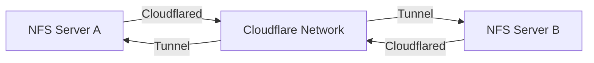

To connect your two NFS sites securely using Cloudflare Tunnels for Syncthing or rsync, follow this step-by-step solution:

### 1. **Architecture Overview**



### 2. **Prerequisites**

* Cloudflare account with a domain (e.g., `yourdomain.com`)
* `cloudflared` installed on both sites (download from [Cloudflare](https://developers.cloudflare.com/cloudflare-one/connections/connect-apps/install-and-setup/))
* NFS shares mounted on local servers at each site
* Firewall rules allowing outbound TCP/443 from both sites

***

### 3. **Step-by-Step Configuration**

#### **Site A Setup**

1. **Create Cloudflare Tunnel**
   ```bash
   cloudflared tunnel create siteA-nfs
   ```
   Note the tunnel ID and credentials file path.

2. **Configure Tunnel (`~/.cloudflared/config.yml`)**
   ```yaml
   tunnel: <TUNNEL_ID>
   credentials-file: ~/.cloudflared/<TUNNEL_ID>.json

   ingress:
     # For rsync (port 873)
     - hostname: rsync.siteA.yourdomain.com
       service: tcp://localhost:873
     # For Syncthing (port 22000)
     - hostname: sync.siteA.yourdomain.com
       service: tcp://localhost:22000
     - service: http_status:404
   ```

3. **Start Tunnel**
   ```bash
   cloudflared tunnel run siteA-nfs
   ```

4. **Create DNS Records**
   In Cloudflare Dashboard:
   * `rsync.siteA.yourdomain.com` → CNAME `<TUNNEL_ID>.cfargotunnel.com`
   * `sync.siteA.yourdomain.com` → CNAME `<TUNNEL_ID>.cfargotunnel.com`

***

#### **Site B Setup**

Repeat the same steps as Site A, replacing:

* Tunnel name: `siteB-nfs`
* Hostnames: `rsync.siteB.yourdomain.com`, `sync.siteB.yourdomain.com`

***

### 4. **Service Configuration**

#### **Option 1: Using rsync**

1. **Enable rsync Daemon** (on both sites)
   Edit `/etc/rsyncd.conf`:
   ```ini
   [nfs-share]
   path = /path/to/nfs/share
   read only = false
   hosts allow = 127.0.0.1
   ```

2. **Start rsync**
   ```bash
   sudo systemctl enable --now rsync
   ```

3. **Sync Commands**
   From Site B to Site A:
```bash
   rsync -avz rsync://rsync.siteA.yourdomain.com/nfs-share /local/backup/
```


#### **Option 2: Using Syncthing**

1. **Install Syncthing** (on both sites)
   ```bash
   sudo apt install syncthing
   ```

2. **Configure Syncthing**
   * Access Web UI: `http://localhost:8384`
   * Add remote device using Site B's address:
     ```
     Device ID: <SITE_B_DEVICE_ID>
     Address: tcp://sync.siteB.yourdomain.com:22000
     ```
   * Share the NFS folder between devices

***

### 5. **Security Enhancements**

1. **Cloudflare Access** (Optional)
   * Add Zero Trust policies to restrict access:
     ```yaml
     # In Cloudflare Dashboard
     Application: rsync.siteA.yourdomain.com
     Policy: Require email@yourdomain.com
     ```

2. **Firewall Rules**
   ```bash
   sudo ufw allow out 443/tcp
   sudo ufw deny in 873/tcp  # Block direct rsync access
   ```

***

### 6. **Testing & Verification**

1. **Test Tunnel Connectivity**
   ```bash
   curl -v https://rsync.siteA.yourdomain.com
   # Should return "Empty reply from server" (TCP tunnel working)
   ```

2. **Verify Data Sync**
   * For rsync: Check file checksums
   * For Syncthing: Monitor Web UI for transfer status

***

### 7. **Troubleshooting**

* **Connection Issues**: Check `cloudflared` logs:
  ```bash
  journalctl -u cloudflared -f
  ```
* **NFS Permissions**: Ensure `uid`/`gid` match across sites
* **Latency**: Use `ping` between Cloudflare endpoints to diagnose network issues

### Key Advantages

* **No Public IPs**: Tunnels work behind NAT/firewalls
* **Encryption**: All traffic end-to-end encrypted
* **Simplicity**: No complex VPN setup required
* **Scalability**: Add more sites by creating additional tunnels

This setup provides secure, encrypted connectivity between your NFS sites using Cloudflare's global network, with options for both file-level (rsync) and continuous (Syncthing) synchronization.
